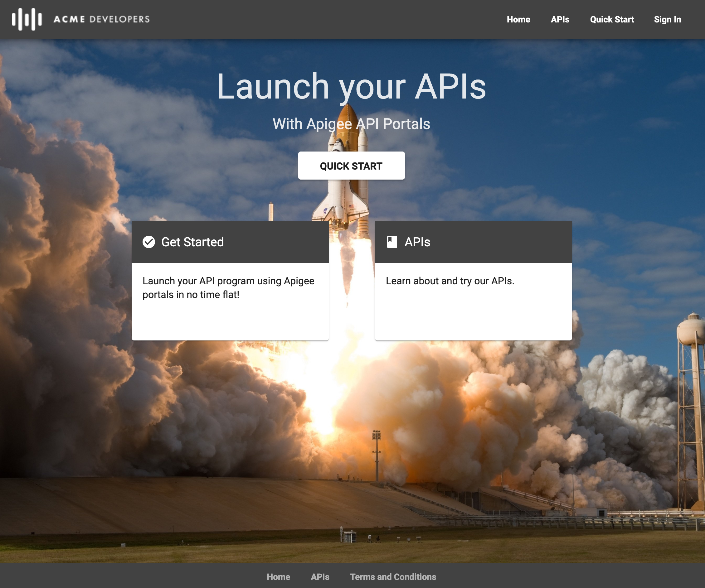
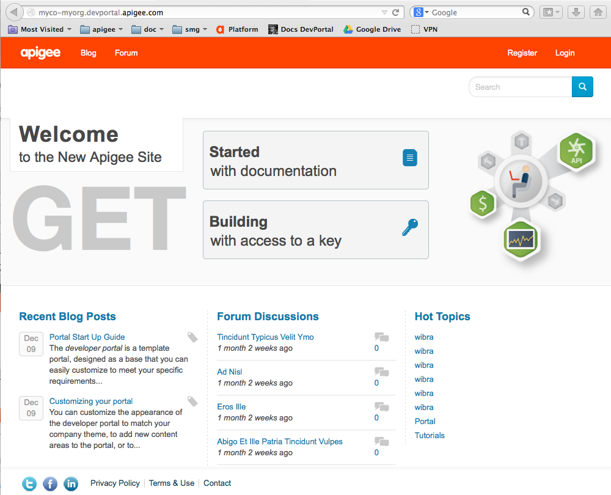
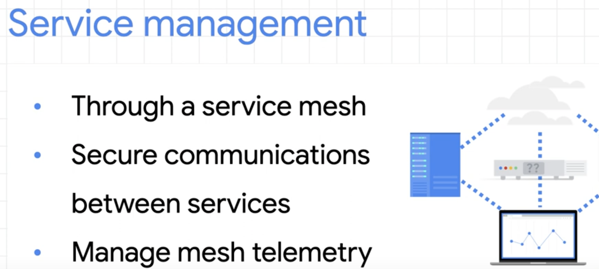
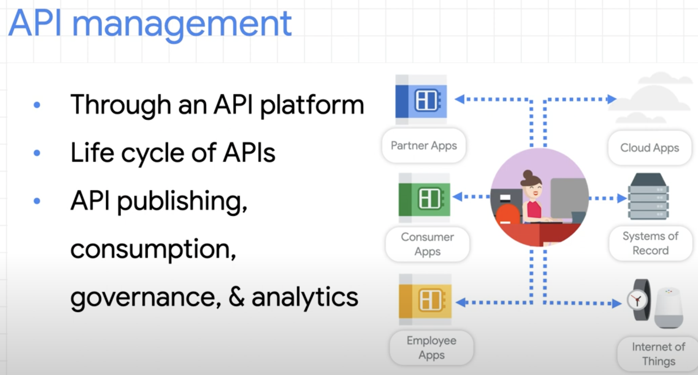
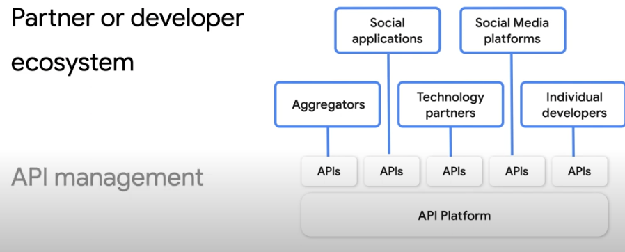
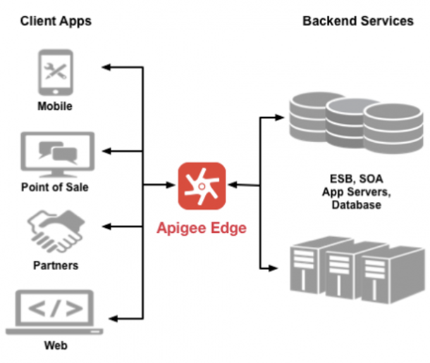

- := Platform
    - allows -- Check '../../README.md'
    - with API proxies -- Check '../../Glossary'
- == API runtime + Monitoring & analytics + Developer ecosystem
  
  - API runtime
  - Monitoring & analytics
    - information to be collected
      - URL
      - IP
      - user ID
      - latency
      - error data
      - …
  - Developer ecosystem
    - valid for any Apigee Edge stack
      - Cloud Apigee Edge
      - [Apigee Edge for Private Cloud] on-premises
    - types
      - integrated portal
      
      - drupal-based portal
      

    

---

# service management vs API management
* [Link](https://www.youtube.com/watch?v=1FV0Vv-me08)
* 👁️both can be used at the same time 👁️
## service management

- == communication between service1 ← & → service2
- use cases
  - standardize service policies
  - monitorize services & SLOs
  - configure networking components
## API management

- == lifecycle of APIs + publishing & consumption & analytics ... of APIs
- use cases
  - service shared internally
  - partner or developer ecosystem
  

---

# Architecture with Apigee Edge

* how does it work?
  * API consumers — access to — API proxy

- TODO: